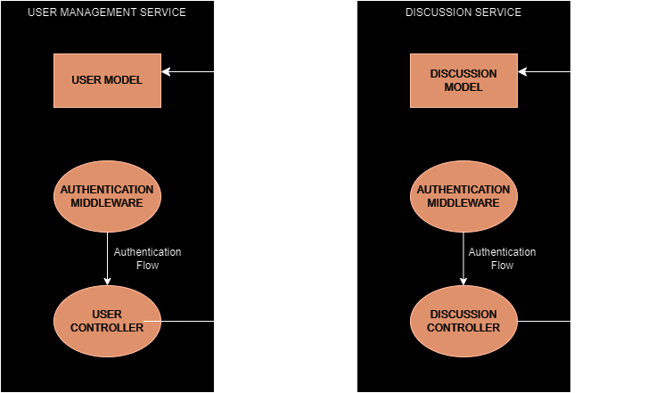

# Microservices Application: User Management & Discussion Services

This repository contains the implementation of a microservices-based application consisting of two services: User Management Service and Discussion Service. These services are designed to manage user-related operations and discussion functionalities within a social media platform.

## Overview

### User Management Service

The User Management Service handles user registration, authentication, and management. It supports features such as creating, updating, deleting users, listing users, searching users by name, and managing user relationships through following functionality.

### Discussion Service

The Discussion Service manages the creation, updating, deletion, and retrieval of discussions. It supports features like creating discussions with text and images, tagging discussions, liking and commenting on discussions, and searching discussions based on text or tags.

## Getting Started

### Prerequisites

Ensure you have Node.js installed on your machine. You can download it from Node.js official website (`https://nodejs.org/en`).

### Installation

1. Clone the repository to your local machine
``
https://github.com/saurabh78crypto/spyne-backend-assignment.git
``

2. Navigate to the root directory of your cloned repository
``
cd spyne-backend-assignment
``

#### Running the Service Locally

#### User Management Service 
3. Navigate to the directory containning the User Management Service
``
cd user-management-service
``

4. Install dependencies for User Management Service and Start the Service
``
npm install
npm start
``

#### Discussion Service 
3. Navigate to the directory containning the Discussion Service
``
cd discussion-service
``

4. Install dependencies for Discussion Service and Start the Service
``
npm install
npm start
``

## API Documentation

### User Management Service

- Create User: POST `/users/reguser`
- Update User: PUT `/users/update/:id`
- Delete User: DELETE `/users/delete/:id`
- List Users: GET `/users/listusers`
- Search User: GET `/users/search`
- Follow User: POST `/users/follow/:userId`

### Discussion Service

- Create Discussion: POST `/discussions`
- Update Discussion: PUT `/discussion/:id`
- Like Discussion: POST `/discussion/like/:discussionid`
- Unlike Discussion: POST `/discussion/unlike/:discussionid`
- Add Comment to Discussion: POST `/discussion/comment`
- Edit Comment of Discussion: PATCH `/discussion/edit-comment/:commentId`
- Delete Comment of Discussion: DELETE `/discussion/delete-comment/:commentId`
- Like Comment of Discussion: POST `/discussion/like-comments/:commentId`
- Reply to Comment of Discussion: POST `/discussion/reply-comments/:commentId`
- Delete Discussion: DELETE `/discussions/discussion/delete/:id`
- Get List of Discussions by Text or Tag: GET `/discussions/discussions/search`
- Increment the View Count of Discussion: GET `/discussions/discussion/:id`

### Low Level Design

